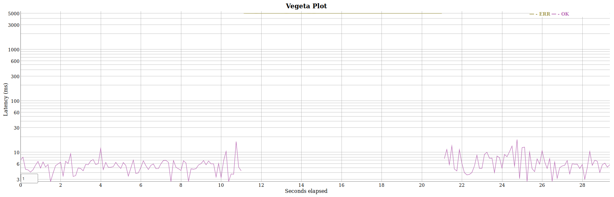

# Connexion Example REST Service with Redis Store

This example application implements a very basic "pet shop" REST service using the [Connexion](https://github.com/zalando/connexion) Python library.
Compared to [hjacobs/connexion-example](https://github.com/hjacobs/connexion-example), this setup focuses more on operational aspects and includes Redis as a persistent storage and Kubernetes deployment manifests.

QUICKSTART: Please follow the [steps to deploy to Kubernetes (Minikube)](#deploying-to-kubernetes-minikube).

This example should demonstrate:

* how to map an [OpenAPI/Swagger specification](https://github.com/OAI/OpenAPI-Specification) to Python code with Connexion
* how to run Connexion with [gevent](http://www.gevent.org/)
* how to build a Docker image for Connexion
* how to integrate a simple persistent database (Redis)
* how to set up Kubernetes manifests for deployment and making sure rolling updates do not cause downtime
* how to configure some best practices for production usage

This example is NOT:

* a real world application (unless you need a REST service to store pets)
* a production-ready service
* a best practice setup for a persistent database (Redis has its own issues, but is used here to keep the database part simple)

DISCLAIMER: While trying to show some best practices for production usage, this is still just an example project --- especially the Redis database setup is not highly available (single replica).

## Local Development

This requires [Pipenv](https://docs.pipenv.org/):

```
pipenv install --dev
pipenv shell
docker run -d --name connexion-example-redis -p 6379:6379 redis:4-alpine
./app.py
xdg-open http://localhost:8080/ui/
```

## Deploying to Kubernetes (Minikube)

First install and then start [Minikube](https://github.com/kubernetes/minikube):

```
minikube start
```

Build the Docker image:

```
eval $(minikube docker-env)
docker build -t connexion-example:local-minikube .
```

Deploy to Kubernetes:

```
kubectl apply -f deploy/
```

Wait for pods to come up:

```
kubectl get pod
```

Create a pet:

```
url=$(minikube service connexion-example --url)
curl -X PUT $url/pets/susie -d '{"animal_type": "cat", "name": "Susie", "tags": {"color": "black"}}' -H Content-Type:application/json
```

Get all pets:

```
curl $url/pets
```

Simple load test with [Vegeta](https://github.com/tsenart/vegeta):

```
echo "GET $url/pets" | vegeta attack -rate 100 -duration 60s | vegeta report
```

The output should look something like this (depends on your hardware/VM configuration):

```
Requests      [total, rate]            6000, 100.02
Duration      [total, attack, wait]    1m0.034341468s, 59.98999991s, 44.341558ms
Latencies     [mean, 50, 95, 99, max]  41.344672ms, 46.279545ms, 52.171431ms, 54.320335ms, 72.515124ms
Bytes In      [total, mean]            3156000, 526.00
Bytes Out     [total, mean]            0, 0.00
Success       [ratio]                  100.00%
Status Codes  [code:count]             200:6000
Error Set:
```

## High Availability

While the setup gracefully handles rolling deployments (try it out by changing a pod label in `deploy/deployment.yaml` and doing `kubectl apply -f deploy/`),
it cannot handle Redis downtimes without causing HTTP errors. Deleting the Redis pod causes a ~10 seconds unavailability for the REST service:


